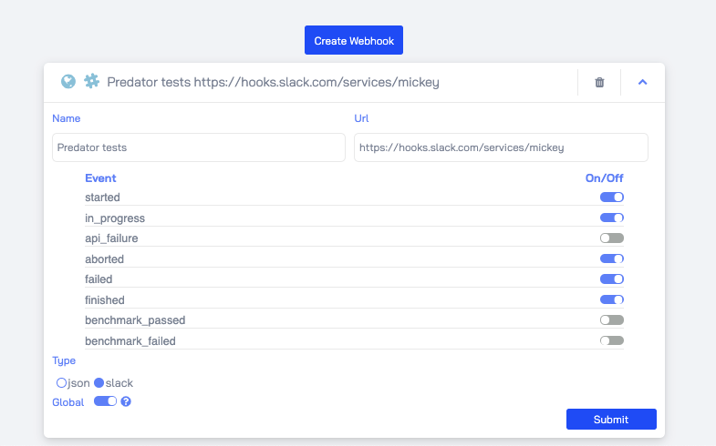

# Webhooks
!!! TIP "Supported from version zooz/predator:1.5.0"

Webhooks are events that notify you on test progress. 
Webhooks are supported in Slack or JSON format for an easy server to server integration. 
You can define a global webhook which will be enabled for system-wide tests or an ad hoc webhook which will be optional on a specific test run.

## Webhook Events
The following test run events are supported when configuring a webhook:

- **Started**: Sent when a test starts.
- **In progress**: Sent after a test run receives its first statistics.
- **API Failure**: Sent if there are 5xx status codes.
- **Aborted**: Sent when a test is aborted.
- **Failed**: Sent when a test fails to run.
- **Finished**: Sent when a test finishes successfully.
- **Benchmark Passed**: Sent when a test finishes successfully and receives an equal or higher score than the allowed threshold.
- **Benchmark Failed**: Sent when a test finishes successfully and receives a lower score than the allowed threshold.

## Setting Up
Webhooks can be set up both in the UI and in the API. For further info please see our <u>[API Reference](apireference.md)</u>.

### Global Webhook
Global webhooks are invoked on all test runs.

### Ad hoc Webhook
Ad hoc webhooks can be paired with a specific test run (either by API/UI).

## Webhook Formats

### Slack
Webhooks can be sent in as a Slack message to any Slack channel with a proper Slack webhook URL.

### JSON
For server to server integration, webhooks can also be sent as an HTTP `POST` request to a configured webhook URL with relevant data in JSON content-type regarding the test's progress and results.

## Example
A global webhook created in Slack format that will invoke a message to the configured Slack channel's URL on every test run that's in the following phases:

 - started 
 - in_progress
 - aborted
 - failed
 - finished
 
